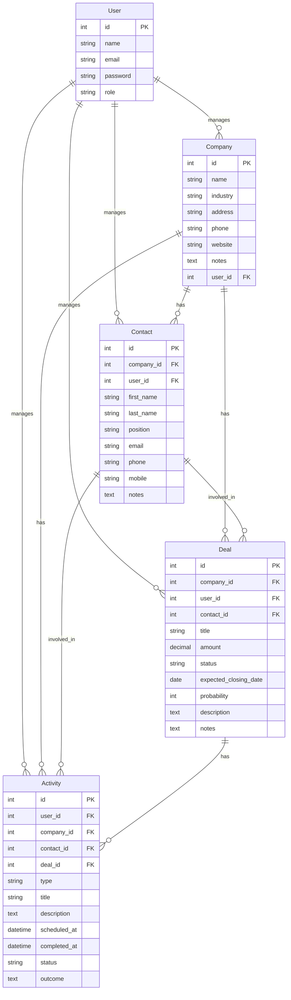
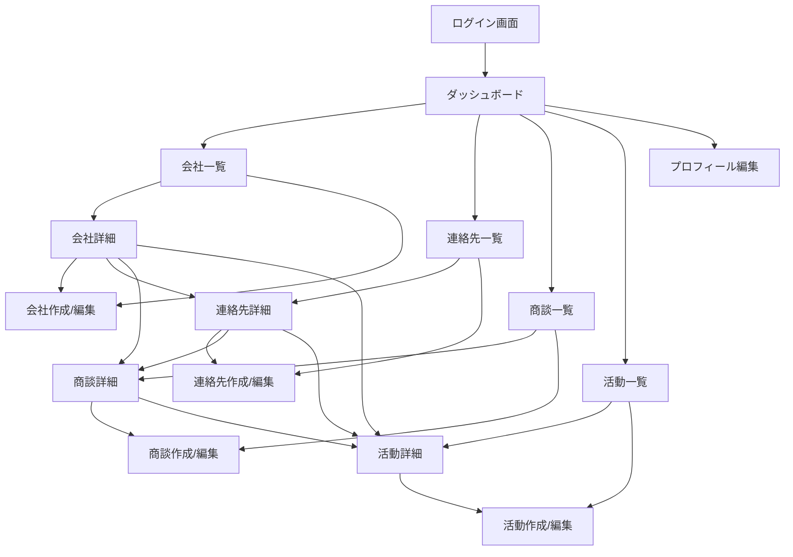

# Laravel CRM アプリケーション要件定義書

## 1. プロジェクト概要

### 1.1 目的と概要
このCRMアプリケーションは、企業の営業活動を管理・追跡するためのシステムです。会社、連絡先、商談、活動などの情報を一元管理し、営業プロセスを効率化することを目的としています。

### 1.2 主要機能の概要
- ユーザー管理（管理者、営業マネージャー、営業担当者）
- 会社管理（顧客企業の情報管理）
- 連絡先管理（顧客企業の担当者管理）
- 商談管理（営業案件の管理）
- 活動管理（営業活動の記録と予定管理）
- ダッシュボード（重要情報の可視化）

### 1.3 対象ユーザー
- 管理者：システム全体の管理
- 営業マネージャー：営業チームと営業活動の管理
- 営業担当者：顧客との関係構築と営業活動の実施

## 2. 機能要件

### 2.1 ユーザー管理機能
- **ユーザー登録/ログイン**
  - 新規ユーザー登録
  - メールアドレスとパスワードによるログイン
  - パスワードリセット機能
  - ログアウト機能
- **ロール管理**
  - 管理者（admin）：システム全体の管理権限
  - 営業マネージャー（sales_manager）：営業チームと営業活動の管理権限
  - 営業担当者（sales_person）：自分が担当する顧客と営業活動の管理権限
- **プロフィール管理**
  - ユーザー情報の編集
  - パスワード変更
### 2.2 会社管理機能
- **会社情報の登録/編集/削除**
  - 会社名、業種、住所、電話番号、ウェブサイト、メモなどの情報を管理
  - 会社情報の編集
  - 会社の削除（ソフトデリート）
- **会社一覧表示**
  - ページネーション付きの会社一覧
  - 検索機能
- **会社詳細表示**
  - 会社の詳細情報表示
  - 関連する連絡先、商談、活動の表示

### 2.3 連絡先管理機能
- **連絡先情報の登録/編集/削除**
  - 名前、役職、メールアドレス、電話番号、携帯電話番号、メモなどの情報を管理
  - 連絡先情報の編集
  - 連絡先の削除（ソフトデリート）
- **連絡先一覧表示**
  - ページネーション付きの連絡先一覧
  - 検索機能
- **連絡先詳細表示**
  - 連絡先の詳細情報表示
  - 関連する商談、活動の表示

### 2.4 商談管理機能
- **商談情報の登録/編集/削除**
  - タイトル、金額、ステータス、予定成約日、成約確率、説明、メモなどの情報を管理
  - 商談情報の編集
  - 商談の削除（ソフトデリート）
- **商談一覧表示**
  - ページネーション付きの商談一覧
  - ステータス別フィルタリング
  - 検索機能
- **商談詳細表示**
  - 商談の詳細情報表示
  - 関連する活動の表示
- **商談ステータス管理**
  - prospecting（見込み）
  - qualification（資格審査）
  - needs_analysis（ニーズ分析）
  - proposal（提案）
  - negotiation（交渉）
  - closed_won（成約）
  - closed_lost（失注）

### 2.5 活動管理機能
- **活動情報の登録/編集/削除**
  - タイプ、タイトル、説明、予定日時、完了日時、ステータス、結果などの情報を管理
  - 活動情報の編集
  - 活動の削除（ソフトデリート）
- **活動一覧表示**
  - ページネーション付きの活動一覧
  - タイプ別、ステータス別フィルタリング
  - 検索機能
- **活動詳細表示**
  - 活動の詳細情報表示
- **活動タイプ管理**
  - call（電話）
  - email（メール）
  - meeting（会議）
  - task（タスク）
  - note（メモ）
- **活動ステータス管理**
  - scheduled（予定）
  - completed（完了）
  - cancelled（キャンセル）

### 2.6 ダッシュボード機能
- **統計情報表示**
  - 会社数
  - 連絡先数
  - 商談数
  - 成約商談数
- **進行中の商談表示**
  - 最新の進行中商談リスト
- **今後の予定活動表示**
  - 今後の予定活動リスト
- **最近の活動履歴表示**
  - 最近の活動履歴リスト

## 3. データモデル

### 3.1 エンティティ関連図（ER図）



### 3.2 各モデルの詳細説明

#### 3.2.1 User（ユーザー）
- **役割**: システムを利用するユーザーを表す
- **主要属性**:
  - id: 主キー
  - name: ユーザー名
  - email: メールアドレス
  - password: パスワード（ハッシュ化）
  - role: ユーザーの役割（admin, sales_manager, sales_person）
- **リレーションシップ**:
  - companies: 一対多（担当会社）
  - contacts: 一対多（担当連絡先）
  - deals: 一対多（担当商談）
  - activities: 一対多（担当活動）

#### 3.2.2 Company（会社）
- **役割**: 顧客企業の情報を表す
- **主要属性**:
  - id: 主キー
  - name: 会社名
  - industry: 業種
  - address: 住所
  - phone: 電話番号
  - website: ウェブサイト
  - notes: メモ
  - user_id: 担当ユーザーID（外部キー）
- **リレーションシップ**:
  - user: 多対一（担当者）
  - contacts: 一対多（連絡先）
  - deals: 一対多（商談）
  - activities: 一対多（活動）

#### 3.2.3 Contact（連絡先）
- **役割**: 顧客企業の担当者情報を表す
- **主要属性**:
  - id: 主キー
  - company_id: 会社ID（外部キー）
  - user_id: 担当ユーザーID（外部キー）
  - first_name: 名
  - last_name: 姓
  - position: 役職
  - email: メールアドレス
  - phone: 電話番号
  - mobile: 携帯電話番号
  - notes: メモ
- **リレーションシップ**:
  - company: 多対一（所属会社）
  - user: 多対一（担当者）
  - deals: 一対多（商談）
  - activities: 一対多（活動）

#### 3.2.4 Deal（商談）
- **役割**: 営業案件の情報を表す
- **主要属性**:
  - id: 主キー
  - company_id: 会社ID（外部キー）
  - user_id: 担当ユーザーID（外部キー）
  - contact_id: 連絡先ID（外部キー）
  - title: タイトル
  - amount: 金額
  - status: ステータス（prospecting, qualification, needs_analysis, proposal, negotiation, closed_won, closed_lost）
  - expected_closing_date: 予定成約日
  - probability: 成約確率
  - description: 説明
  - notes: メモ
- **リレーションシップ**:
  - company: 多対一（関連会社）
  - user: 多対一（担当者）
  - contact: 多対一（関連連絡先）
  - activities: 一対多（活動）

#### 3.2.5 Activity（活動）
- **役割**: 営業活動の記録を表す
- **主要属性**:
  - id: 主キー
  - user_id: 担当ユーザーID（外部キー）
  - company_id: 会社ID（外部キー）
  - contact_id: 連絡先ID（外部キー）
  - deal_id: 商談ID（外部キー）
  - type: タイプ（call, email, meeting, task, note）
  - title: タイトル
  - description: 説明
  - scheduled_at: 予定日時
  - completed_at: 完了日時
  - status: ステータス（scheduled, completed, cancelled）
  - outcome: 結果
- **リレーションシップ**:
  - user: 多対一（担当者）
  - company: 多対一（関連会社）
  - contact: 多対一（関連連絡先）
  - deal: 多対一（関連商談）

### 3.3 リレーションシップ
- User - Company: 一対多（一人のユーザーが複数の会社を担当）
- User - Contact: 一対多（一人のユーザーが複数の連絡先を担当）
- User - Deal: 一対多（一人のユーザーが複数の商談を担当）
- User - Activity: 一対多（一人のユーザーが複数の活動を担当）
- Company - Contact: 一対多（一つの会社に複数の連絡先）
- Company - Deal: 一対多（一つの会社に複数の商談）
- Company - Activity: 一対多（一つの会社に複数の活動）
- Contact - Deal: 一対多（一人の連絡先に複数の商談）
- Contact - Activity: 一対多（一人の連絡先に複数の活動）
- Deal - Activity: 一対多（一つの商談に複数の活動）
## 4. 画面設計

### 4.1 画面一覧
- ログイン画面
- ダッシュボード画面
- 会社一覧画面
- 会社詳細画面
- 会社作成/編集画面
- 連絡先一覧画面
- 連絡先詳細画面
- 連絡先作成/編集画面
- 商談一覧画面
- 商談詳細画面
- 商談作成/編集画面
- 活動一覧画面
- 活動詳細画面
- 活動作成/編集画面
- プロフィール編集画面

### 4.2 画面遷移図



### 4.3 各画面の詳細説明

#### 4.3.1 ダッシュボード画面
- **目的**: システム全体の概要を表示
- **主要コンポーネント**:
  - 統計情報（会社数、連絡先数、商談数、成約商談数）
  - 進行中の商談リスト
  - 今後の予定活動リスト
  - 最近の活動履歴リスト
- **アクション**:
  - 新規商談作成
  - 新規活動作成

#### 4.3.2 会社一覧画面
- **目的**: 登録されている会社の一覧を表示
- **主要コンポーネント**:
  - 会社リスト（ページネーション付き）
  - 検索機能
- **アクション**:
  - 新規会社作成
  - 会社詳細表示
  - 会社編集
  - 会社削除

#### 4.3.3 会社詳細画面
- **目的**: 特定の会社の詳細情報を表示
- **主要コンポーネント**:
  - 会社基本情報
  - 関連連絡先リスト
  - 関連商談リスト
  - 関連活動リスト
- **アクション**:
  - 会社情報編集
  - 会社削除
  - 新規連絡先作成
  - 新規商談作成
  - 新規活動作成

#### 4.3.4 連絡先一覧画面
- **目的**: 登録されている連絡先の一覧を表示
- **主要コンポーネント**:
  - 連絡先リスト（ページネーション付き）
  - 検索機能
- **アクション**:
  - 新規連絡先作成
  - 連絡先詳細表示
  - 連絡先編集
  - 連絡先削除

#### 4.3.5 商談一覧画面
- **目的**: 登録されている商談の一覧を表示
- **主要コンポーネント**:
  - 商談リスト（ページネーション付き）
  - フィルタリング機能（ステータス別）
  - 検索機能
- **アクション**:
  - 新規商談作成
  - 商談詳細表示
  - 商談編集
  - 商談削除

#### 4.3.6 活動一覧画面
- **目的**: 登録されている活動の一覧を表示
- **主要コンポーネント**:
  - 活動リスト（ページネーション付き）
  - フィルタリング機能（タイプ別、ステータス別）
  - 検索機能
- **アクション**:
  - 新規活動作成
  - 活動詳細表示
  - 活動編集
  - 活動削除

## 5. 技術要件

### 5.1 バックエンド技術
- PHP 8.1以上
- Laravel 10.x
- MVC（Model-View-Controller）アーキテクチャ

### 5.2 フロントエンド技術
- HTML
- CSS
- JavaScript
- Tailwind CSS（CSSフレームワーク）
- Blade（Laravelのテンプレートエンジン）

### 5.3 データベース
- MySQL 8.0以上 または PostgreSQL 13以上
- マイグレーションによるデータベース構造管理
- Eloquent ORM（Object-Relational Mapping）

### 5.4 認証システム
- Laravel Breeze（認証スターターキット）
- ロールベースのアクセス制御

### 5.5 システム要件
- PHP 8.1以上
- Composer（PHPのパッケージマネージャー）
- Node.js と npm（JavaScriptのパッケージマネージャー）
- Webサーバー（Apache/Nginx）

## 6. 実装ステップ

### 6.1 環境構築

#### 6.1.1 前提条件
- PHP 8.1以上がインストールされていること
- Composerがインストールされていること
- Node.jsとnpmがインストールされていること
- MySQLまたはPostgreSQLがインストールされていること

#### 6.1.2 Laravelのインストール
```bash
# Laravelプロジェクトの作成
composer create-project laravel/laravel laravel_crm
cd laravel_crm

# 依存パッケージのインストール
composer install
npm install
```

#### 6.1.3 環境設定
1. `.env`ファイルの設定
```
# .envファイルをコピー
cp .env.example .env

# アプリケーションキーの生成
php artisan key:generate

# データベース接続情報の設定
DB_CONNECTION=mysql
DB_HOST=127.0.0.1
DB_PORT=3306
DB_DATABASE=laravel_crm
DB_USERNAME=root
DB_PASSWORD=your_password
```

2. Laravel Breezeのインストール（認証機能）
```bash
# Breezeのインストール
composer require laravel/breeze --dev

# Bladeスタックでのインストール
php artisan breeze:install blade

# アセットのビルド
npm install
npm run dev
```

### 6.2 データベース設計と実装

#### 6.2.1 マイグレーションファイルの作成

1. **ユーザーテーブルにロールを追加**
```bash
php artisan make:migration add_role_to_users_table --table=users
```

```php
// database/migrations/xxxx_xx_xx_add_role_to_users_table.php
public function up()
{
    Schema::table('users', function (Blueprint $table) {
        $table->string('role')->default('sales_person');
    });
}

public function down()
{
    Schema::table('users', function (Blueprint $table) {
        $table->dropColumn('role');
    });
}
```

2. **会社テーブルの作成**
```bash
php artisan make:migration create_companies_table
```

```php
// database/migrations/xxxx_xx_xx_create_companies_table.php
public function up()
{
    Schema::create('companies', function (Blueprint $table) {
        $table->id();
        $table->string('name');
        $table->string('industry')->nullable();
        $table->text('address')->nullable();
        $table->string('phone')->nullable();
        $table->string('website')->nullable();
        $table->text('notes')->nullable();
        $table->foreignId('user_id')->constrained();
        $table->timestamps();
        $table->softDeletes();
    });
}

public function down()
{
    Schema::dropIfExists('companies');
}
```

3. **連絡先テーブルの作成**
```bash
php artisan make:migration create_contacts_table
```

```php
// database/migrations/xxxx_xx_xx_create_contacts_table.php
public function up()
{
    Schema::create('contacts', function (Blueprint $table) {
        $table->id();
        $table->foreignId('company_id')->constrained();
        $table->foreignId('user_id')->constrained();
        $table->string('first_name');
        $table->string('last_name');
        $table->string('position')->nullable();
        $table->string('email')->nullable();
        $table->string('phone')->nullable();
        $table->string('mobile')->nullable();
        $table->text('notes')->nullable();
        $table->timestamps();
        $table->softDeletes();
    });
}

public function down()
{
    Schema::dropIfExists('contacts');
}
```

4. **商談テーブルの作成**
```bash
php artisan make:migration create_deals_table
```

```php
// database/migrations/xxxx_xx_xx_create_deals_table.php
public function up()
{
    Schema::create('deals', function (Blueprint $table) {
        $table->id();
        $table->foreignId('company_id')->constrained();
        $table->foreignId('user_id')->constrained();
        $table->foreignId('contact_id')->nullable()->constrained();
        $table->string('title');
        $table->decimal('amount', 15, 2);
        $table->string('status');
        $table->date('expected_closing_date')->nullable();
        $table->integer('probability')->default(0);
        $table->text('description')->nullable();
        $table->text('notes')->nullable();
        $table->timestamps();
        $table->softDeletes();
    });
}

public function down()
{
    Schema::dropIfExists('deals');
}
```

5. **活動テーブルの作成**
```bash
php artisan make:migration create_activities_table
```

```php
// database/migrations/xxxx_xx_xx_create_activities_table.php
public function up()
{
    Schema::create('activities', function (Blueprint $table) {
        $table->id();
        $table->foreignId('user_id')->constrained();
        $table->foreignId('company_id')->constrained();
        $table->foreignId('contact_id')->nullable()->constrained();
        $table->foreignId('deal_id')->nullable()->constrained();
        $table->string('type');
        $table->string('title');
        $table->text('description')->nullable();
        $table->dateTime('scheduled_at')->nullable();
        $table->dateTime('completed_at')->nullable();
        $table->string('status');
        $table->text('outcome')->nullable();
        $table->timestamps();
        $table->softDeletes();
    });
}

public function down()
{
    Schema::dropIfExists('activities');
}
```

#### 6.2.2 マイグレーションの実行
```bash
# マイグレーションの実行
php artisan migrate
```

### 6.3 モデル実装

#### 6.3.1 Userモデルの拡張
```php
// app/Models/User.php
<?php

namespace App\Models;

use Illuminate\Database\Eloquent\Factories\HasFactory;
use Illuminate\Foundation\Auth\User as Authenticatable;
use Illuminate\Notifications\Notifiable;

class User extends Authenticatable
{
    use HasFactory, Notifiable;

    protected $fillable = [
        'name',
        'email',
        'password',
        'role',
    ];

    protected $hidden = [
        'password',
        'remember_token',
    ];

    protected $casts = [
        'email_verified_at' => 'datetime',
        'password' => 'hashed',
    ];

    const ROLE_ADMIN = 'admin';
    const ROLE_SALES_MANAGER = 'sales_manager';
    const ROLE_SALES_PERSON = 'sales_person';

    public function isAdmin()
    {
        return $this->role === self::ROLE_ADMIN;
    }

    public function isSalesManager()
    {
        return $this->role === self::ROLE_SALES_MANAGER;
    }

    public function isSalesPerson()
    {
        return $this->role === self::ROLE_SALES_PERSON;
    }

    public function companies()
    {
        return $this->hasMany(Company::class);
    }

    public function contacts()
    {
        return $this->hasMany(Contact::class);
    }

    public function deals()
    {
        return $this->hasMany(Deal::class);
    }

    public function activities()
    {
        return $this->hasMany(Activity::class);
    }

    public function scopeManagers($query)
    {
        return $query->where('role', self::ROLE_SALES_MANAGER);
    }

    public function scopeSalesPeople($query)
    {
        return $query->where('role', self::ROLE_SALES_PERSON);
    }
}
```

#### 6.3.2 Companyモデルの作成
```php
// app/Models/Company.php
<?php

namespace App\Models;

use Illuminate\Database\Eloquent\Model;
use Illuminate\Database\Eloquent\SoftDeletes;
use Illuminate\Database\Eloquent\Factories\HasFactory;

class Company extends Model
{
    use HasFactory, SoftDeletes;

    protected $fillable = [
        'name',
        'industry',
        'address',
        'phone',
        'website',
        'notes',
        'user_id'
    ];

    public function user()
    {
        return $this->belongsTo(User::class);
    }

    public function contacts()
    {
        return $this->hasMany(Contact::class);
    }

    public function deals()
    {
        return $this->hasMany(Deal::class);
    }

    public function activities()
    {
        return $this->hasMany(Activity::class);
    }
}
```

#### 6.3.3 Contactモデルの作成
```php
// app/Models/Contact.php
<?php

namespace App\Models;

use Illuminate\Database\Eloquent\Model;
use Illuminate\Database\Eloquent\SoftDeletes;
use Illuminate\Database\Eloquent\Factories\HasFactory;

class Contact extends Model
{
    use HasFactory, SoftDeletes;

    protected $fillable = [
        'company_id',
        'user_id',
        'first_name',
        'last_name',
        'position',
        'email',
        'phone',
        'mobile',
        'notes'
    ];

    public function company()
    {
        return $this->belongsTo(Company::class);
    }

    public function user()
    {
        return $this->belongsTo(User::class);
    }

    public function deals()
    {
        return $this->hasMany(Deal::class);
    }

    public function activities()
    {
        return $this->hasMany(Activity::class);
    }

    public function getFullNameAttribute()
    {
        return "{$this->first_name} {$this->last_name}";
    }
}
```

#### 6.3.4 Dealモデルの作成
```php
// app/Models/Deal.php
<?php

namespace App\Models;

use Illuminate\Database\Eloquent\Model;
use Illuminate\Database\Eloquent\SoftDeletes;
use Illuminate\Database\Eloquent\Factories\HasFactory;

class Deal extends Model
{
    use HasFactory, SoftDeletes;

    protected $fillable = [
        'company_id',
        'user_id',
        'contact_id',
        'title',
        'amount',
        'status',
        'expected_closing_date',
        'probability',
        'description',
        'notes'
    ];

    protected $casts = [
        'amount' => 'decimal:2',
        'probability' => 'integer',
        'expected_closing_date' => 'date'
    ];

    const STATUSES = [
        'prospecting',
        'qualification',
        'needs_analysis',
        'proposal',
        'negotiation',
        'closed_won',
        'closed_lost'
    ];

    public function company()
    {
        return $this->belongsTo(Company::class);
    }

    public function user()
    {
        return $this->belongsTo(User::class);
    }

    public function contact()
    {
        return $this->belongsTo(Contact::class);
    }

    public function activities()
    {
        return $this->hasMany(Activity::class);
    }

    public function isWon()
    {
        return $this->status === 'closed_won';
    }

    public function isLost()
    {
        return $this->status === 'closed_lost';
    }

    public function isClosed()
    {
        return $this->isWon() || $this->isLost();
    }
}
```

#### 6.3.5 Activityモデルの作成
```php
// app/Models/Activity.php
<?php

namespace App\Models;

use Illuminate\Database\Eloquent\Model;
use Illuminate\Database\Eloquent\SoftDeletes;
use Illuminate\Database\Eloquent\Factories\HasFactory;

class Activity extends Model
{
    use HasFactory, SoftDeletes;

    protected $fillable = [
        'user_id',
        'company_id',
        'contact_id',
        'deal_id',
        'type',
        'title',
        'description',
        'scheduled_at',
        'completed_at',
        'status',
        'outcome'
    ];

    protected $casts = [
        'scheduled_at' => 'datetime',
        'completed_at' => 'datetime'
    ];

    const TYPES = [
        'call',
        'email',
        'meeting',
        'task',
        'note'
    ];

    const STATUSES = [
        'scheduled',
        'completed',
        'cancelled'
    ];

    public function user()
    {
        return $this->belongsTo(User::class);
    }

    public function company()
    {
        return $this->belongsTo(Company::class);
    }

    public function contact()
    {
        return $this->belongsTo(Contact::class);
    }

    public function deal()
    {
        return $this->belongsTo(Deal::class);
    }

    public function isCompleted()
    {
        return $this->status === 'completed';
    }

    public function isCancelled()
    {
        return $this->status === 'cancelled';
    }

    public function isPending()
    {
        return $this->status === 'scheduled';
    }

    public function scopeUpcoming($query)
    {
        return $query->where('status', 'scheduled')
                    ->where('scheduled_at', '>=', now())
                    ->orderBy('scheduled_at');
    }

    public function scopeOverdue($query)
    {
        return $query->where('status', 'scheduled')
                    ->where('scheduled_at', '<', now())
                    ->orderBy('scheduled_at');
    }
}
```

### 6.4 コントローラー実装

#### 6.4.1 DashboardControllerの作成
```bash
php artisan make:controller DashboardController
```

```php
// app/Http/Controllers/DashboardController.php
<?php

namespace App\Http\Controllers;

use Illuminate\Http\Request;

class DashboardController extends Controller
{
    /**
     * ダッシュボードを表示
     */
    public function index()
    {
        // 最近の活動を取得
        $recentActivities = \App\Models\Activity::with(['company', 'contact', 'deal'])
            ->latest()
            ->take(5)
            ->get();

        // 進行中の商談を取得
        $activeDeals = \App\Models\Deal::with(['company', 'contact'])
            ->whereNotIn('status', ['closed_won', 'closed_lost'])
            ->latest()
            ->take(5)
            ->get();

        // 今後の予定を取得
        $upcomingActivities = \App\Models\Activity::with(['company', 'contact'])
            ->where('status', 'scheduled')
            ->where('scheduled_at', '>=', now())
            ->orderBy('scheduled_at')
            ->take(5)
            ->get();

        // 企業数、担当者数、商談数を取得
        $counts = [
            'companies' => \App\Models\Company::count(),
            'contacts' => \App\Models\Contact::count(),
            'deals' => \App\Models\Deal::count(),
            'won_deals' => \App\Models\Deal::where('status', 'closed_won')->count(),
        ];

        return view('dashboard', compact(
            'recentActivities',
            'activeDeals',
            'upcomingActivities',
            'counts'
        ));
    }
}
```

#### 6.4.2 CompanyControllerの作成
```bash
php artisan make:controller CompanyController --resource
```

```php
// app/Http/Controllers/CompanyController.php
<?php

namespace App\Http\Controllers;

use App\Models\Company;
use Illuminate\Http\Request;
use Illuminate\Support\Facades\Auth;

class CompanyController extends Controller
{
    /**
     * Display a listing of the resource.
     */
    public function index()
    {
        $companies = Company::orderBy('name')->paginate(10);
        return view('companies.index', compact('companies'));
    }

    /**
     * Show the form for creating a new resource.
     */
    public function create()
    {
        return view('companies.create');
    }

    /**
     * Store a newly created resource in storage.
     */
    public function store(Request $request)
    {
        $validated = $request->validate([
            'name' => 'required|string|max:255',
            'industry' => 'nullable|string|max:255',
            'address' => 'nullable|string',
            'phone' => 'nullable|string|max:20',
            'website' => 'nullable|string|max:255',
            'notes' => 'nullable|string',
        ]);

        $validated['user_id'] = Auth::id();

        $company = Company::create($validated);

        return redirect()->route('companies.show', $company)
            ->with('success', __('Company created successfully.'));
    }

    /**
     * Display the specified resource.
     */
    public function show(Company $company)
    {
        $contacts = $company->contacts()->orderBy('last_name')->get();
        $deals = $company->deals()->latest()->get();
        $activities = $company->activities()->latest()->get();

        return view('companies.show', compact('company', 'contacts', 'deals', 'activities'));
    }

    /**
     * Show the form for editing the specified resource.
     */
    public function edit(Company $company)
    {
        return view('companies.edit', compact('company'));
    }

    /**
     * Update the specified resource in storage.
     */
    public function update(Request $request, Company $company)
    {
        $validated = $request->validate([
            'name' => 'required|string|max:255',
            'industry' => 'nullable|string|max:255',
            'address' => 'nullable|string',
            'phone' => 'nullable|string|max:20',
            'website' => 'nullable|string|max:255',
            'notes' => 'nullable|string',
        ]);

        $company->update($validated);

        return redirect()->route('companies.show', $company)
            ->with('success', __('Company updated successfully.'));
    }

    /**
     * Remove the specified resource from storage.
     */
    public function destroy(Company $company)
    {
        $company->delete();

        return redirect()->route('companies.index')
            ->with('success', __('Company deleted successfully.'));
    }
}
```

### 6.5 ルート設定
```php
// routes/web.php
<?php

use Illuminate\Support\Facades\Route;
use App\Http\Controllers\DashboardController;
use App\Http\Controllers\CompanyController;
use App\Http\Controllers\ContactController;
use App\Http\Controllers\DealController;
use App\Http\Controllers\ActivityController;
use App\Http\Controllers\ProfileController;

Route::get('/', function () {
    return redirect()->route('dashboard');
});

Route::middleware(['auth'])->group(function () {
    Route::get('/dashboard', [DashboardController::class, 'index'])->name('dashboard');

    Route::resource('companies', CompanyController::class);
    Route::resource('contacts', ContactController::class);
    Route::resource('deals', DealController::class);
    Route::resource('activities', ActivityController::class);

    Route::get('/profile', [ProfileController::class, 'edit'])->name('profile.edit');
    Route::patch('/profile', [ProfileController::class, 'update'])->name('profile.update');
    Route::delete('/profile', [ProfileController::class, 'destroy'])->name('profile.destroy');
});

require __DIR__.'/auth.php';
```

### 6.6 ビュー実装
ビューの実装は、Bladeテンプレートを使用して行います。各画面のビューファイルを作成し、必要なコンポーネントを実装します。

### 6.7 シーダーの作成
初期データを投入するためのシーダーを作成します。

```bash
php artisan make:seeder AdminUserSeeder
```

```php
// database/seeders/AdminUserSeeder.php
<?php

namespace Database\Seeders;

use App\Models\User;
use Illuminate\Database\Seeder;
use Illuminate\Support\Facades\Hash;

class AdminUserSeeder extends Seeder
{
    /**
     * Run the database seeds.
     */
    public function run(): void
    {
        User::create([
            'name' => '管理者',
            'email' => 'admin@example.com',
            'password' => Hash::make('password'),
            'role' => User::ROLE_ADMIN,
        ]);
    }
}
```

```bash
php artisan db:seed --class=AdminUserSeeder
```

### 6.8 アプリケーションの起動
```bash
# 開発サーバーの起動
php artisan serve

# フロントエンドのビルド（開発モード）
npm run dev
```

これで、Laravel CRMアプリケーションの基本的な実装が完了します。