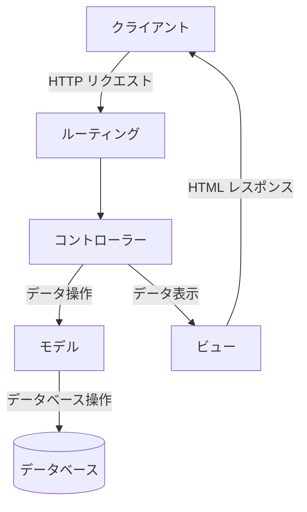
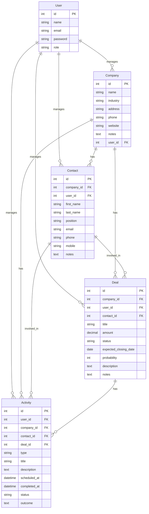
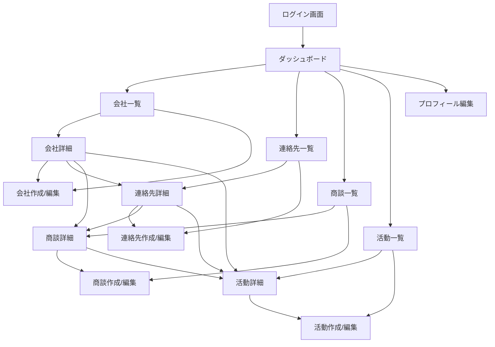

# Laravel CRM アプリケーション仕様書

## 1. システム概要

### 1.1 目的と概要
このCRMアプリケーションは、企業の営業活動を管理・追跡するためのシステムです。会社、連絡先、商談、活動などの情報を一元管理し、営業プロセスを効率化することを目的としています。

### 1.2 主要機能の概要
- ユーザー管理（管理者、営業マネージャー、営業担当者）
- 会社管理（顧客企業の情報管理）
- 連絡先管理（顧客企業の担当者管理）
- 商談管理（営業案件の管理）
- 活動管理（営業活動の記録と予定管理）
- ダッシュボード（重要情報の可視化）

### 1.3 対象ユーザー
- 管理者：システム全体の管理
- 営業マネージャー：営業チームと営業活動の管理
- 営業担当者：顧客との関係構築と営業活動の実施

## 2. システム構成

### 2.1 アーキテクチャ
このアプリケーションはMVCアーキテクチャに基づいて構築されています。



### 2.2 使用技術とフレームワーク
- バックエンド：PHP 8.x、Laravel 10.x
- フロントエンド：HTML、CSS、JavaScript、Tailwind CSS
- データベース：MySQL/PostgreSQL
- 認証：Laravel Breeze

### 2.3 システム要件
- PHP 8.1以上
- Composer
- Node.js と npm
- MySQL 8.0以上 または PostgreSQL 13以上
- Webサーバー（Apache/Nginx）

## 3. データモデル

### 3.1 エンティティ関連図（ER図）



### 3.2 各モデルの詳細説明

#### 3.2.1 User（ユーザー）
- **役割**: システムを利用するユーザーを表す
- **主要属性**:
  - id: 主キー
  - name: ユーザー名
  - email: メールアドレス
  - password: パスワード（ハッシュ化）
  - role: ユーザーの役割（admin, sales_manager, sales_person）
- **リレーションシップ**:
  - companies: 一対多（担当会社）
  - contacts: 一対多（担当連絡先）
  - deals: 一対多（担当商談）
  - activities: 一対多（担当活動）

#### 3.2.2 Company（会社）
- **役割**: 顧客企業の情報を表す
- **主要属性**:
  - id: 主キー
  - name: 会社名
  - industry: 業種
  - address: 住所
  - phone: 電話番号
  - website: ウェブサイト
  - notes: メモ
  - user_id: 担当ユーザーID（外部キー）
- **リレーションシップ**:
  - user: 多対一（担当者）
  - contacts: 一対多（連絡先）
  - deals: 一対多（商談）
  - activities: 一対多（活動）

#### 3.2.3 Contact（連絡先）
- **役割**: 顧客企業の担当者情報を表す
- **主要属性**:
  - id: 主キー
  - company_id: 会社ID（外部キー）
  - user_id: 担当ユーザーID（外部キー）
  - first_name: 名
  - last_name: 姓
  - position: 役職
  - email: メールアドレス
  - phone: 電話番号
  - mobile: 携帯電話番号
  - notes: メモ
- **リレーションシップ**:
  - company: 多対一（所属会社）
  - user: 多対一（担当者）
  - deals: 一対多（商談）
  - activities: 一対多（活動）

#### 3.2.4 Deal（商談）
- **役割**: 営業案件の情報を表す
- **主要属性**:
  - id: 主キー
  - company_id: 会社ID（外部キー）
  - user_id: 担当ユーザーID（外部キー）
  - contact_id: 連絡先ID（外部キー）
  - title: タイトル
  - amount: 金額
  - status: ステータス（prospecting, qualification, needs_analysis, proposal, negotiation, closed_won, closed_lost）
  - expected_closing_date: 予定成約日
  - probability: 成約確率
  - description: 説明
  - notes: メモ
- **リレーションシップ**:
  - company: 多対一（関連会社）
  - user: 多対一（担当者）
  - contact: 多対一（関連連絡先）
  - activities: 一対多（活動）

#### 3.2.5 Activity（活動）
- **役割**: 営業活動の記録を表す
- **主要属性**:
  - id: 主キー
  - user_id: 担当ユーザーID（外部キー）
  - company_id: 会社ID（外部キー）
  - contact_id: 連絡先ID（外部キー）
  - deal_id: 商談ID（外部キー）
  - type: タイプ（call, email, meeting, task, note）
  - title: タイトル
  - description: 説明
  - scheduled_at: 予定日時
  - completed_at: 完了日時
  - status: ステータス（scheduled, completed, cancelled）
  - outcome: 結果
- **リレーションシップ**:
  - user: 多対一（担当者）
  - company: 多対一（関連会社）
  - contact: 多対一（関連連絡先）
  - deal: 多対一（関連商談）

### 3.3 リレーションシップ
- User - Company: 一対多（一人のユーザーが複数の会社を担当）
- User - Contact: 一対多（一人のユーザーが複数の連絡先を担当）
- User - Deal: 一対多（一人のユーザーが複数の商談を担当）
- User - Activity: 一対多（一人のユーザーが複数の活動を担当）
- Company - Contact: 一対多（一つの会社に複数の連絡先）
- Company - Deal: 一対多（一つの会社に複数の商談）
- Company - Activity: 一対多（一つの会社に複数の活動）
- Contact - Deal: 一対多（一人の連絡先に複数の商談）
- Contact - Activity: 一対多（一人の連絡先に複数の活動）
- Deal - Activity: 一対多（一つの商談に複数の活動）

## 4. 機能仕様

### 4.1 ユーザー管理機能
- ユーザー登録
- ユーザーログイン/ログアウト
- パスワードリセット
- プロフィール編集
- ユーザーロール管理（admin, sales_manager, sales_person）

### 4.2 会社管理機能
- 会社一覧表示（ページネーション付き）
- 会社詳細表示
- 会社新規作成
- 会社情報編集
- 会社削除（ソフトデリート）
- 会社に関連する連絡先、商談、活動の表示

### 4.3 連絡先管理機能
- 連絡先一覧表示
- 連絡先詳細表示
- 連絡先新規作成
- 連絡先情報編集
- 連絡先削除（ソフトデリート）
- 連絡先に関連する商談、活動の表示

### 4.4 商談管理機能
- 商談一覧表示
- 商談詳細表示
- 商談新規作成
- 商談情報編集
- 商談削除（ソフトデリート）
- 商談ステータス管理（prospecting, qualification, needs_analysis, proposal, negotiation, closed_won, closed_lost）
- 商談に関連する活動の表示

### 4.5 活動管理機能
- 活動一覧表示
- 活動詳細表示
- 活動新規作成
- 活動情報編集
- 活動削除（ソフトデリート）
- 活動タイプ管理（call, email, meeting, task, note）
- 活動ステータス管理（scheduled, completed, cancelled）
- 活動の予定日時と完了日時の管理

### 4.6 ダッシュボード機能
- 統計情報表示（会社数、連絡先数、商談数、成約商談数）
- 進行中の商談表示
- 今後の予定活動表示
- 最近の活動履歴表示

## 5. 画面仕様

### 5.1 画面一覧
- ログイン画面
- ダッシュボード画面
- 会社一覧画面
- 会社詳細画面
- 会社作成/編集画面
- 連絡先一覧画面
- 連絡先詳細画面
- 連絡先作成/編集画面
- 商談一覧画面
- 商談詳細画面
- 商談作成/編集画面
- 活動一覧画面
- 活動詳細画面
- 活動作成/編集画面
- プロフィール編集画面

### 5.2 画面遷移図



### 5.3 各画面の詳細説明

#### 5.3.1 ダッシュボード画面
- **目的**: システム全体の概要を表示
- **主要コンポーネント**:
  - 統計情報（会社数、連絡先数、商談数、成約商談数）
  - 進行中の商談リスト
  - 今後の予定活動リスト
  - 最近の活動履歴リスト
- **アクション**:
  - 新規商談作成
  - 新規活動作成

#### 5.3.2 会社一覧画面
- **目的**: 登録されている会社の一覧を表示
- **主要コンポーネント**:
  - 会社リスト（ページネーション付き）
  - 検索機能
- **アクション**:
  - 新規会社作成
  - 会社詳細表示
  - 会社編集
  - 会社削除

#### 5.3.3 会社詳細画面
- **目的**: 特定の会社の詳細情報を表示
- **主要コンポーネント**:
  - 会社基本情報
  - 関連連絡先リスト
  - 関連商談リスト
  - 関連活動リスト
- **アクション**:
  - 会社情報編集
  - 会社削除
  - 新規連絡先作成
  - 新規商談作成
  - 新規活動作成

#### 5.3.4 連絡先一覧画面
- **目的**: 登録されている連絡先の一覧を表示
- **主要コンポーネント**:
  - 連絡先リスト（ページネーション付き）
  - 検索機能
- **アクション**:
  - 新規連絡先作成
  - 連絡先詳細表示
  - 連絡先編集
  - 連絡先削除

#### 5.3.5 商談一覧画面
- **目的**: 登録されている商談の一覧を表示
- **主要コンポーネント**:
  - 商談リスト（ページネーション付き）
  - フィルタリング機能（ステータス別）
  - 検索機能
- **アクション**:
  - 新規商談作成
  - 商談詳細表示
  - 商談編集
  - 商談削除

#### 5.3.6 活動一覧画面
- **目的**: 登録されている活動の一覧を表示
- **主要コンポーネント**:
  - 活動リスト（ページネーション付き）
  - フィルタリング機能（タイプ別、ステータス別）
  - 検索機能
- **アクション**:
  - 新規活動作成
  - 活動詳細表示
  - 活動編集
  - 活動削除

## 6. ユーザーロールと権限

### 6.1 ロールの種類
- **管理者（admin）**: システム全体の管理権限を持つ
- **営業マネージャー（sales_manager）**: 営業チームと営業活動の管理権限を持つ
- **営業担当者（sales_person）**: 自分が担当する顧客と営業活動の管理権限を持つ

### 6.2 権限マトリックス

| 機能 | 管理者 | 営業マネージャー | 営業担当者 |
|------|--------|-----------------|------------|
| ユーザー管理 | 全て | 閲覧のみ | 閲覧のみ（自分のみ） |
| 会社管理 | 全て | 全て | 担当会社のみ |
| 連絡先管理 | 全て | 全て | 担当連絡先のみ |
| 商談管理 | 全て | 全て | 担当商談のみ |
| 活動管理 | 全て | 全て | 担当活動のみ |
| レポート閲覧 | 全て | チーム全体 | 自分のみ |

## 7. API仕様

### 7.1 エンドポイント一覧
- `/api/companies/{company}/contacts`: 特定の会社に関連する連絡先を取得
- `/api/companies/{company}/deals`: 特定の会社に関連する商談を取得

### 7.2 リクエスト/レスポンス形式
- リクエスト: GET
- レスポンス: JSON

#### 7.2.1 `/api/companies/{company}/contacts` レスポンス例
```json
[
  {
    "id": 1,
    "full_name": "山田 太郎"
  },
  {
    "id": 2,
    "full_name": "鈴木 花子"
  }
]
```

#### 7.2.2 `/api/companies/{company}/deals` レスポンス例
```json
[
  {
    "id": 1,
    "title": "新規システム導入案件"
  },
  {
    "id": 2,
    "title": "保守契約更新"
  }
]
```

## 8. 非機能要件

### 8.1 パフォーマンス要件
- ページロード時間: 3秒以内
- データベースクエリ最適化
- キャッシュ機能の活用

### 8.2 セキュリティ要件
- HTTPS通信
- パスワードハッシュ化
- CSRF対策
- XSS対策
- SQLインジェクション対策
- 適切なアクセス制御

### 8.3 可用性要件
- システム稼働率: 99.5%以上
- バックアップ: 日次
- 障害復旧時間: 4時間以内